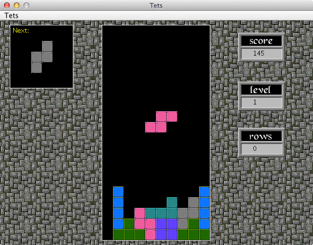

# Make Lines

[](https://travis-ci.org/Mario-Lopez/makelines)

### You Must Make Some Lines

#### With Blocks

##### Before It's Too Late
  
Game is currently in alpha.  Art assets are not final.  


# Running the game

## Build the source code
To build the source code, run the appropriate command for your OS.

### Mac/Linux

```bash
./gradlew clean build
```

### Windows

```bash
./gradlew.bat clean build
```

## Launch the application
After building the source code, you can run the game using the appropriate command for your OS.

### Mac

```bash
open build/macApp/makelines.app
```

### Linux

```bash
./gradlew run
```

### Windows

```bash
./gradlew.bat run
```
